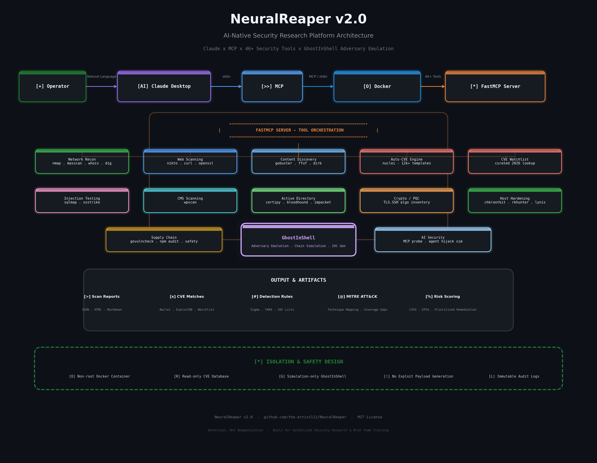

```
    ███╗   ██╗███████╗██╗   ██╗██████╗  █████╗ ██╗
    ████╗  ██║██╔════╝██║   ██║██╔══██╗██╔══██╗██║
    ██╔██╗ ██║█████╗  ██║   ██║██████╔╝███████║██║
    ██║╚██╗██║██╔══╝  ██║   ██║██╔══██╗██╔══██║██║
    ██║ ╚████║███████╗╚██████╔╝██║  ██║██║  ██║███████╗
    ╚═╝  ╚═══╝╚══════╝ ╚═════╝ ╚═╝  ╚═╝╚═╝  ╚═╝╚══════╝
     ██████╗ ███████╗ █████╗ ██████╗ ███████╗██████╗
     ██╔══██╗██╔════╝██╔══██╗██╔══██╗██╔════╝██╔══██╗
     ██████╔╝█████╗  ███████║██████╔╝█████╗  ██████╔╝
     ██╔══██╗██╔══╝  ██╔══██║██╔══██╗██╔══╝  ██╔══██╗
     ██║  ██║███████╗██║  ██║██║  ██║███████╗██║  ██║
     ╚═╝  ╚═╝╚══════╝╚═╝  ╚═╝╚═╝  ╚═╝╚══════╝╚═╝  ╚═╝
```

<div align="center">

### AI-Native Security Research Platform — Claude × MCP × Real Offensive Tooling

*Natural language in. Real recon, real CVE matches, real AD attack paths, real crypto posture out.*

[](LICENSE)
[](https://www.python.org/)
[](https://www.docker.com/)
[](https://modelcontextprotocol.io)
[](README.md#tool-arsenal)
[]()
</div>

---

## Table of Contents

- [Why NeuralReaper](#why-neuralreaper)
- [Design Philosophy — Detection, Not Weaponization](#design-philosophy--detection-not-weaponization)
- [Architecture](#architecture)
- [Tool Arsenal](#tool-arsenal)
- [Quick Start](#quick-start)
- [Detailed Setup](#detailed-setup)
- [Usage Examples](#usage-examples)
- [Security & Safety Design](#security--safety-design)
- [Engineering Notes — Real Problems Solved](#engineering-notes--real-problems-solved)
- [Project Structure](#project-structure)
- [Roadmap](#roadmap)
- [Contributing](#contributing)
- [Disclaimer](#disclaimer)
- [License](#license)

---

## Why NeuralReaper

Most "AI + security" demos wire a chatbot up to a single API and call it a day. NeuralReaper instead gives Claude **direct, sandboxed execution access** to a real offensive security toolchain — the same binaries a human pentester would run from a terminal — through the [Model Context Protocol](https://modelcontextprotocol.io).

The result: you describe an objective in plain English, and Claude plans and executes the actual recon — choosing tools, chaining scans, and reasoning over real output — instead of guessing from training data.

What makes it worth putting on a resume rather than just a script:

- **A live, auto-updating CVE engine.** [Nuclei](https://github.com/projectdiscovery/nuclei) ships 12,000+ community templates and is updated continuously, so the scanner isn't frozen at whatever existed when the image was built.
- **Isolated by design.** Every tool runs inside a locked-down, non-root Ubuntu container — never on the host.
- **A real engineering trail.** Built across Windows + WSL2 + Docker Desktop + Claude Desktop, hitting (and solving) the exact integration failures documented below instead of glossing over them.
- **Breadth across the full modern assessment surface** — network/web recon, Active Directory attack-path enumeration, cryptographic/post-quantum posture, supply-chain dependency auditing, and local fuzzing — not just a wrapper around one scanner.

---

## Design Philosophy — Detection, Not Weaponization

Comparable AI-agent pentest frameworks exist, and some — most notably [HexStrike AI](https://hexstrike.com/) — ship an automated exploit-generation layer on top of recon/scanning. Within hours of HexStrike's public release, researchers observed threat actors discussing how to weaponize it against a Citrix NetScaler zero-day (CVE-2025-7775), compressing what used to take days of manual exploit development into roughly 10 minutes.

NeuralReaper deliberately stops one step earlier. Every tool here identifies, enumerates, and reports — it does not generate exploit payloads, and it never will. The CVE watchlist is lookup-only: it calls existing Nuclei templates and ExploitDB entries for matches, writing zero new detection or exploitation logic of its own.

That's a constraint, not a missing feature — and worth saying explicitly: building security tooling with an eye on how it could be misused is itself a skill.
---

## Architecture


```

Claude Desktop spawns the container per-session over stdio — there is no persistent network listener, no exposed port, and no state retained between runs beyond what Docker itself caches (e.g. Nuclei's template directory) and the in-memory session log used by `generate_report()`.

---

## GhostInShell — Adversary Emulation Engine

GhostInShell is NeuralReaper v2.0's adversary emulation module. It simulates multi-stage attack chains based on real-world CVEs and TTPs, generating detection artifacts for blue team training and validation.

### What GhostInShell Does

| Capability | Output | Purpose |
|------------|--------|---------|
| **Attack Surface Analysis** | Prioritized list of potential attack vectors | Recon planning for authorized engagements |
| **Exploit Chain Simulation** | Graph-optimized sequence of simulated exploits | Purple team exercise planning |
| **IOC Generation** | File paths, registry keys, network indicators | Detection rule development |
| **MITRE ATT&CK Mapping** | Technique and sub-technique IDs | Coverage gap analysis |
| **Detection Test Cases** | Sigma/YARA rule stubs | SIEM/EDR validation |

## Tool Arsenal

| Category | Tool(s) | What it does |
|---|---|---|
| **Network Recon** | `nmap`, `masscan`, `whois`, `dig`, `traceroute`, `ping` | Service/version detection, full-range port sweeps, DNS/WHOIS enumeration |
| **Web Scanning** | `nikto`, `curl`, `openssl` | Misconfig checks, header inspection, TLS/cert validation |
| **Content Discovery** | `gobuster`, `ffuf`, `dirb` | Directory/DNS brute-force, high-speed fuzzing |
| **Auto-CVE Engine** | `nuclei` | 12,000+ templates — CVEs, misconfig, exposures, default creds |
| **Curated CVE Watchlist** | `cve_watchlist_scan` | Lookup-only orchestration of Nuclei + ExploitDB against a curated list of recent high-severity CVE IDs |
| **Injection Testing** | `sqlmap`, `xsstrike` | SQL injection and XSS detection with WAF fingerprinting |
| **CMS Scanning** | `wpscan` | WordPress core/plugin/theme vulnerability enumeration |
| **Active Directory & Identity** | `certipy`, `bloodhound-python`, `bloodyAD`, Impacket (`GetUserSPNs.py`, `GetNPUsers.py`) | ADCS misconfig (ESC1–16), AD data collection, ACL/object enumeration, Kerberoast/AS-REProast detection |
| **Cryptographic Inventory / Post-Quantum** | nmap `ssl-enum-ciphers` / `ssh2-enum-algos` | TLS & SSH algorithm inventory; Harvest-Now-Decrypt-Later risk classification |
| **Host Hardening & Rootkit Detection** | `chkrootkit`, `rkhunter`, `lynis` | Signature-based rootkit checks and general Linux hardening audit |
| **Ransomware-Relevant Exposure** | nmap + nuclei (curated tags) | External RDP/SMB/VPN exposure check — attack-surface only, not infection detection |
| **Supply Chain** | `osv-scanner` | Dependency CVE audit against the OSV.dev database |
| **Fuzzing** | `AFL++` | Crash-finding fuzzing harness automation against a local instrumented binary |
| **OWASP Reference** | — | Static Top-10 (Web) and Top-10 (Agentic/AI) checklists mapped to tool coverage |
| **Recon Orchestrator** | — | `full_recon` chains DNS/WHOIS/port/tech-fingerprint recon into one attack-surface summary with suggested test priorities by detected stack |
| **Session Reporting** | — | `generate_report` compiles every tool call this session into one Markdown report with a severity summary |
| **Exploit Research** | `searchsploit` | Offline ExploitDB lookup by product or CVE |

50+ MCP tools total — run `tool_help` inside Claude for the full callable list with parameters.

---
### Simulated CVE Coverage (2026)

GhostInShell's simulation library includes attack chain modeling for:

| CVE | Category | Simulation Focus |
|-----|----------|------------------|
| CVE-2026-8461 | FFmpeg RCE | Media processing attack surface, file upload validation |
| CVE-2026-55200 | libssh2 RCE | SSH service hardening, packet size limit testing |
| CVE-2026-20253 | Splunk RCE | REST API auth validation, app installation policies |
| CVE-2026-31431 | Linux Kernel LPE | Splice syscall monitoring, SUID binary auditing |
| CVE-2026-45648 | AD DS NSPI | RPC filter verification, DC hardening |
| CVE-2026-50751 | Check Point VPN | SSLVPN portal auth testing, VPN appliance patching |

### Example GhostInShell Workflow

```bash
# Simulate an attack chain against a target profile
"Simulate a full compromise chain against my lab environment at 192.168.56.10"

# Output:
# [+] GhostInShell session GHOST-A7B3C9D8E1F2 initiated
# [+] Objective: full_compromise | Stealth: enabled | Max Depth: 3
# [+] Attack surface mapped: 5 vectors identified
# [+] Optimal exploit chain built: CVE-2026-20253 -> CVE-2026-31431 -> CVE-2026-45648
# [+] Detection artifacts generated: 12 IOCs, 4 Sigma rules, 3 MITRE techniques mapped
# [+] Report saved to: reports/ghost_a7b3c9d8e1f2.json

## Quick Start

```bash
git clone https://github.com/the-artist111/NeuralReaper.git
cd NeuralReaper
docker build -t neuralreaper:latest .
```

Point Claude Desktop at it by merging `claude_desktop_config.json` into your own config, then restart Claude Desktop. Full instructions below.

---

## Detailed Setup

<details>
<summary><strong>Linux</strong></summary>

```bash
git clone https://github.com/the-artist111/NeuralReaper.git
cd NeuralReaper
docker build -t neuralreaper:latest .

mkdir -p ~/.config/Claude
cp claude_desktop_config.json ~/.config/Claude/claude_desktop_config.json
# restart Claude Desktop
```

</details>

<details>
<summary><strong>Windows via WSL2 (recommended on Windows)</strong></summary>

1. Install **Docker Desktop** for Windows.
2. In Docker Desktop → **Settings → Resources → WSL Integration**, enable your distro (e.g. Ubuntu) and **Apply & Restart**.
3. Inside your WSL2 distro:
   ```bash
   git clone https://github.com/the-artist111/NeuralReaper.git
   cd NeuralReaper
   docker build -t neuralreaper:latest .
   ```
4. Copy the config to Windows (run from PowerShell, **not** WSL — cross-filesystem writes from WSL into `AppData` are frequently permission-denied):
   ```powershell
   New-Item -ItemType Directory -Force -Path "$env:APPDATA\Claude"
   Copy-Item "\\wsl.localhost\Ubuntu\home\<user>\NeuralReaper\claude_desktop_config.json" "$env:APPDATA\Claude\claude_desktop_config.json"
   ```
5. **Docker Desktop must be running** before Claude Desktop launches the container — Claude calls `docker.exe` directly, and if the daemon isn't up yet you'll see `failed to connect to the docker API at npipe:////./pipe/dockerDesktopLinuxEngine`.
6. Fully quit and reopen Claude Desktop (system tray → Quit, not just close-the-window).

</details>

<details>
<summary><strong>Verifying the install</strong></summary>

```bash
bash tests/smoke_test.sh
```

Or check directly inside Claude Desktop: **Settings → Developer → Local MCP servers**. NeuralReaper should show a `running` badge. If it shows `failed`, click **View Logs** — the error is almost always either "Docker Desktop isn't running" or a stale `docker` path in the config.

</details>

---

## Usage Examples

```
"Update Nuclei templates, then run a full CVE scan on 192.168.1.10"
"Check my lab DC against the curated CVE watchlist, then check its TLS for post-quantum readiness"
"Run certipy_find against my lab domain, then check for kerberoastable accounts"
"Run a full_recon on target.local and tell me what to prioritize testing"
"Audit this container's hardening with lynis, then run chkrootkit"
"Check 192.168.1.50 for ransomware-relevant exposure, then generate a report of everything we've found this session"
```

Sample tail of a real `nuclei_scan` run:

```
=== NUCLEI SCAN: http://192.168.56.10 [severity=critical,high,medium] ===
[CVE-2026-41940] [http] [critical] Apache HTTP Server path traversal — 192.168.56.10
[exposed-panel:phpmyadmin] [http] [medium] phpMyAdmin panel exposed — 192.168.56.10/pma/
[tech-detect:nginx] [http] [info] nginx 1.24.0 detected
```

Sample `pqc_readiness_check` output:

```
=== PQC / HNDL READINESS: target.local:443 ===
HNDL Risk Level: HIGH (classical-only key exchange — prioritize for PQ migration if data sensitivity/longevity is high)

- [HNDL RISK] No post-quantum hybrid key exchange group detected. Traffic captured today could be
  decrypted retroactively once a sufficiently large quantum computer exists.
- [CLASSICAL] RSA key exchange/signature present — broken by Shor's algorithm on a sufficiently
  large quantum computer. Long-lived sensitive data is the highest-priority migration candidate.
```

---

## Security & Safety Design

This is a security tool, so it's held to its own standard:

- **Non-root execution.** The container runs as an unprivileged `pentester` user; only `nmap` and `masscan` get the specific `CAP_NET_RAW` / `CAP_NET_ADMIN` capabilities they need via `setcap` — nothing runs `--privileged`.
- **Input sanitization.** Every target string is validated against a strict allow-list pattern before it touches a subprocess call; nothing is passed through a shell, so there's no string-concatenation injection surface.
- **Hard timeouts.** Every tool call is bounded (`MAX_TOOL_RUNTIME`, default 180s) so a hung scan can't hang the MCP session indefinitely.
- **No persistent listener.** The container is spawned per-session over stdio and torn down with `--rm` — there's no exposed port or standing service to leave open by accident.
- **Stateless between runs.** No scan history, credentials, or target lists are written to disk inside the container.

Known limitation: `--network host` is a native-Linux Docker feature. On Docker Desktop (Windows/macOS) it runs inside a managed VM, so host-network-dependent scans (e.g. raw ARP discovery) behave correctly on Linux hosts but may need bridge-network + port-mapping adjustments on Windows/macOS — tracked in [Roadmap](#roadmap).

---

## Engineering Notes — Real Problems Solved

Authentic build log, kept here deliberately instead of polished away — this is the part that's actually interesting in an interview.

| Problem | Root Cause | Fix |
|---|---|---|
| `apt-get install` failed on `gcc-16`/`libexpat1` with 404s | Kali **rolling** repo had a transient broken dependency chain at build time (`libgcc-15-dev` requiring an unavailable `libtsan2` version) | Migrated base image from `kalilinux/kali-rolling` to `ubuntu:24.04`; replaced Kali-only packages (`wpscan`, `ffuf`, `exploitdb`) with `gem install`, a pinned GitHub binary release, and a direct GitLab clone respectively |
| `wpscan` / `ffuf` not found via `apt-get` | Not Ubuntu-packaged | `gem install wpscan` (it's a Ruby gem); `ffuf` pulled as a prebuilt release binary |
| `docker: command not found` inside WSL2 despite Docker Desktop running | Docker Desktop's **WSL Integration** toggle was off for that specific distro | Settings → Resources → WSL Integration → enable the distro → Apply & Restart |
| `mkdir: Permission denied` writing to `/mnt/c/Users/.../AppData/Roaming/Claude` from WSL2 | Cross-filesystem writes from WSL2 into Windows `AppData` hit Windows ACL restrictions even as root inside WSL2 | Did the copy from native **PowerShell** instead, reading the WSL2 file via the `\\wsl.localhost\` UNC path |
| Tool never appeared in Claude's tool list at all | Claude was running as the **Microsoft Store** package (`...\WindowsApps\Claude_...`), which is sandboxed and never reads `%APPDATA%\Claude\claude_desktop_config.json` | Uninstalled the Store package, installed the direct `.exe` from claude.ai/download instead |
| MCP server showed `failed` — `Server disconnected` | Logs showed `failed to connect to the docker API at npipe:////./pipe/dockerDesktopLinuxEngine` | Docker Desktop simply wasn't running yet when Claude Desktop tried to spawn the container — config and image were already correct |

The takeaway that mattered most: **read the actual log file before changing anything.** Every fix above came from `%APPDATA%\Claude\logs\mcp-server-NeuralReaper.log`, not guesswork.

---

## Project Structure

```
NeuralReaper/
├── agents/                 # Claude agent configurations
├── docs/                   # Documentation and assets
│   └── assets/
│       └── neuralreaper-ascii.png    # ASCII art logo
├── examples/               # Example workflows and outputs
├── tests/                  # Unit and integration tests
├── tools/                  # MCP tool definitions (46+ tools)
│   ├── recon/              # Network and web reconnaissance
│   │   ├── nmap_scan.py
│   │   ├── masscan_scan.py
│   │   └── whois_lookup.py
│   ├── web/                # Web scanning and injection testing
│   │   ├── nikto_scan.py
│   │   ├── sqlmap_scan.py
│   │   └── xsstrike_scan.py
│   ├── ad/                 # Active Directory tools
│   │   ├── certipy_enum.py
│   │   ├── bloodhound_ingest.py
│   │   └── kerberoast_check.py
│   ├── crypto/             # Cryptographic audit tools
│   │   ├── tls_inventory.py
│   │   └── ssh_algo_audit.py
│   ├── host/               # Host hardening and rootkit detection
│   │   ├── lynis_audit.py
│   │   └── chkrootkit_scan.py
│   ├── supply_chain/       # Dependency and CI/CD security
│   │   ├── dependency_check.py
│   │   └── typosquat_scan.py
│   ├── ai_security/        # AI agent and MCP security probes
│   │   ├── mcp_enumerate.py
│   │   └── prompt_inject_sim.py
│   └── ghostinshell/       # Adversary emulation engine
│       ├── ghost_engine.py       # Core simulation engine
│       ├── chain_builder.py    # Graph-based chain optimizer
│       ├── ioc_generator.py    # Detection artifact generation
│       └── mitre_mapper.py     # ATT&CK technique mapping
├── server.py               # FastMCP server entry point
├── Dockerfile              # Container definition
├── docker-compose.yml      # Orchestration config
├── claude_desktop_config.json  # Claude Desktop integration
├── requirements.txt        # Python dependencies
├── CHANGELOG.md            # Version history
├── CONTRIBUTING.md         # Contribution guidelines
├── SECURITY.md             # Security policy and reporting
└── LICENSE                 # MIT License
```

---

## Roadmap

| Version | Planned Feature                                          | Status   |
| ------- | -------------------------------------------------------- | -------- |
| v2.1    | GhostInShell MITRE ATT\&CK Navigator export              | Planned  |
| v2.1    | Sigma rule auto-generation from simulation chains        | Planned  |
| v2.2    | Cloud-native attack path simulation (AWS/Azure/GCP)      | Planned  |
| v2.2    | Kubernetes security assessment tools                     | Planned  |
| v3.0    | Multi-agent Claude orchestration for complex assessments | Research |


---

## Contributing

We welcome contributions that align with our Detection, Not Weaponization philosophy. Please see CONTRIBUTING.md for guidelines.
Types of contributions we love:
New MCP tool integrations for reconnaissance and detection
Additional Nuclei template categories for the CVE watchlist
GhostInShell simulation scenarios for emerging attack techniques
Documentation and tutorial improvements
Bug fixes and performance optimizations
Types of contributions we will not accept:
Exploit payload generation or weaponization features
Tools designed to bypass security controls on target systems
Any code that executes attacks against systems without explicit authorization


---

## Disclaimer

NeuralReaper is intended for authorized security research, penetration testing, and defensive training only. Users are responsible for ensuring they have explicit permission before scanning or assessing any target.
The GhostInShell adversary emulation module generates only simulated outputs and detection artifacts — it does not execute attacks against live systems. All exploit chain modeling is performed in-memory with no network egress.
By using this software, you agree to:
Only scan systems you own or have written authorization to test
Comply with all applicable laws and regulations in your jurisdiction
Not use this tool for unauthorized access, data theft, or disruption of services

---

## License

MIT License
Copyright (c) 2026 the-artist111
Permission is hereby granted, free of charge, to any person obtaining a copy
of this software and associated documentation files (the "Software"), to deal
in the Software without restriction, including without limitation the rights
to use, copy, modify, merge, publish, distribute, sublicense, and/or sell
copies of the Software, and to permit persons to whom the Software is
furnished to do so, subject to the following conditions:
The above copyright notice and this permission notice shall be included in all
copies or substantial portions of the Software.
THE SOFTWARE IS PROVIDED "AS IS", WITHOUT WARRANTY OF ANY KIND, EXPRESS OR
IMPLIED, INCLUDING BUT NOT LIMITED TO THE WARRANTIES OF MERCHANTABILITY,
FITNESS FOR A PARTICULAR PURPOSE AND NONINFRINGEMENT. IN NO EVENT SHALL THE
AUTHORS OR COPYRIGHT HOLDERS BE LIABLE FOR ANY CLAIM, DAMAGES OR OTHER
LIABILITY, WHETHER IN AN ACTION OF CONTRACT, TORT OR OTHERWISE, ARISING FROM,
OUT OF OR IN CONNECTION WITH THE SOFTWARE OR THE USE OR OTHER DEALINGS IN THE
SOFTWARE.

---

<div align="center">

Built with [Anthropic MCP](https://modelcontextprotocol.io) · [ProjectDiscovery Nuclei](https://github.com/projectdiscovery/nuclei) · [XSStrike](https://github.com/s0md3v/XSStrike)

</div>
