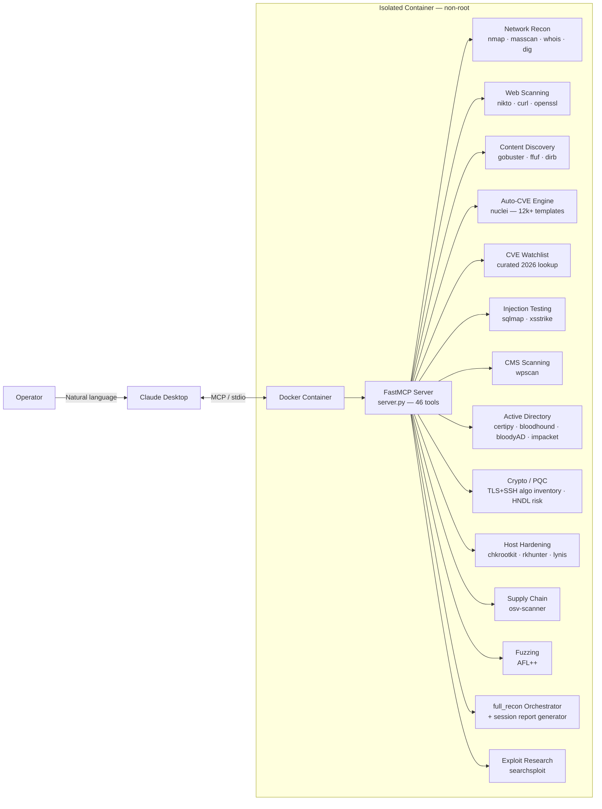

```
    ███╗   ██╗███████╗██╗   ██╗██████╗  █████╗ ██╗
    ████╗  ██║██╔════╝██║   ██║██╔══██╗██╔══██╗██║
    ██╔██╗ ██║█████╗  ██║   ██║██████╔╝███████║██║
    ██║╚██╗██║██╔══╝  ██║   ██║██╔══██╗██╔══██║██║
    ██║ ╚████║███████╗╚██████╔╝██║  ██║██║  ██║███████╗
    ╚═╝  ╚═══╝╚══════╝ ╚═════╝ ╚═╝  ╚═╝╚═╝  ╚═╝╚══════╝
     ██████╗ ███████╗ █████╗ ██████╗ ███████╗██████╗
     ██╔══██╗██╔════╝██╔══██╗██╔══██╗██╔════╝██╔══██╗
     ██████╔╝█████╗  ███████║██████╔╝█████╗  ██████╔╝
     ██╔══██╗██╔══╝  ██╔══██║██╔══██╗██╔══╝  ██╔══██╗
     ██║  ██║███████╗██║  ██║██║  ██║███████╗██║  ██║
     ╚═╝  ╚═╝╚══════╝╚═╝  ╚═╝╚═╝  ╚═╝╚══════╝╚═╝  ╚═╝
```

<div align="center">

### AI-Native Security Research Platform — Claude × MCP × Real Offensive Tooling

*Natural language in. Real recon, real CVE matches, real AD attack paths, real crypto posture out.*

[](LICENSE)
[](https://www.python.org/)
[](https://www.docker.com/)
[](https://modelcontextprotocol.io)
[]()

</div>

---

## Table of Contents

- [Why NeuralReaper](#why-neuralreaper)
- [Design Philosophy — Detection, Not Weaponization](#design-philosophy--detection-not-weaponization)
- [Architecture](#architecture)
- [Tool Arsenal](#tool-arsenal)
- [Quick Start](#quick-start)
- [Detailed Setup](#detailed-setup)
- [Usage Examples](#usage-examples)
- [Security & Safety Design](#security--safety-design)
- [Engineering Notes — Real Problems Solved](#engineering-notes--real-problems-solved)
- [Project Structure](#project-structure)
- [Roadmap](#roadmap)
- [Contributing](#contributing)
- [Disclaimer](#disclaimer)
- [License](#license)

---

## Why NeuralReaper

Most "AI + security" demos wire a chatbot up to a single API and call it a day. NeuralReaper instead gives Claude **direct, sandboxed execution access** to a real offensive security toolchain — the same binaries a human pentester would run from a terminal — through the [Model Context Protocol](https://modelcontextprotocol.io).

The result: you describe an objective in plain English, and Claude plans and executes the actual recon — choosing tools, chaining scans, and reasoning over real output — instead of guessing from training data.

What makes it worth putting on a resume rather than just a script:

- **A live, auto-updating CVE engine.** [Nuclei](https://github.com/projectdiscovery/nuclei) ships 12,000+ community templates and is updated continuously, so the scanner isn't frozen at whatever existed when the image was built.
- **Isolated by design.** Every tool runs inside a locked-down, non-root Kali/Ubuntu container — never on the host.
- **A real engineering trail.** Built across Windows + WSL2 + Docker Desktop + Claude Desktop, hitting (and solving) the exact integration failures documented below instead of glossing over them.
- **Breadth across the full modern assessment surface** — network/web recon, Active Directory attack-path enumeration, cryptographic/post-quantum posture, supply-chain dependency auditing, and local fuzzing — not just a wrapper around one scanner.

---

## Design Philosophy — Detection, Not Weaponization

Comparable AI-agent pentest frameworks exist, and some — most notably [HexStrike AI](https://hexstrike.com) — ship an automated exploit-generation component on top of recon/scanning. That design choice has a documented downside: within hours of HexStrike's public release, security researchers observed threat actors on dark-web forums discussing how to weaponize it, tied to real-world exploitation of Citrix NetScaler zero-days (CVE-2025-7775) — attackers used the framework's own automation to compress what used to take days of manual exploit development down to roughly 10 minutes.

NeuralReaper deliberately stops one step earlier in that chain. Every tool here **identifies, enumerates, and reports** — it does not generate working exploit payloads, and it never will. Where the underlying open-source tool's normal function is itself the "exploit" step against an authorized target (`sqlmap` extracting data from an injectable parameter you own, `certipy` requesting a certificate via a misconfigured template in your own lab) that's wrapped the same way the security community already treats those tools. What's intentionally absent is any *novel* exploit-generation, payload-crafting, or autonomous weaponization layer — including for the specific CVEs referenced in this README. The CVE watchlist below is **lookup-only**: it calls existing Nuclei templates and ExploitDB entries for matches, and writes zero detection or exploitation logic of its own for any named vulnerability.

That's a constraint, not a missing feature — and it's worth saying explicitly in a portfolio context: building security tooling responsibly, with an eye on how it could be misused, is itself a skill.

---

## Architecture



Claude Desktop spawns the container per-session over stdio — there is no persistent network listener, no exposed port, and no state retained between runs beyond what Docker itself caches (e.g. Nuclei's template directory) and the in-memory session log used by `generate_report()`.

---

## Tool Arsenal

| Category | Tool(s) | What it does |
|---|---|---|
| **Network Recon** | `nmap`, `masscan`, `whois`, `dig`, `traceroute`, `ping` | Service/version detection, full-range port sweeps, DNS/WHOIS enumeration |
| **Web Scanning** | `nikto`, `curl`, `openssl` | Misconfig checks, header inspection, TLS/cert validation |
| **Content Discovery** | `gobuster`, `ffuf`, `dirb` | Directory/DNS brute-force, high-speed fuzzing |
| **Auto-CVE Engine** | `nuclei` | 12,000+ templates — CVEs, misconfig, exposures, default creds |
| **Curated CVE Watchlist** | `cve_watchlist_scan` | Lookup-only orchestration of Nuclei + ExploitDB against a curated list of recent high-severity CVE IDs |
| **Injection Testing** | `sqlmap`, `xsstrike` | SQL injection and XSS detection with WAF fingerprinting |
| **CMS Scanning** | `wpscan` | WordPress core/plugin/theme vulnerability enumeration |
| **Active Directory & Identity** | `certipy`, `bloodhound-python`, `bloodyAD`, Impacket (`GetUserSPNs.py`, `GetNPUsers.py`) | ADCS misconfig (ESC1–16), AD data collection, ACL/object enumeration, Kerberoast/AS-REProast detection |
| **Cryptographic Inventory / Post-Quantum** | nmap `ssl-enum-ciphers` / `ssh2-enum-algos` | TLS & SSH algorithm inventory; Harvest-Now-Decrypt-Later risk classification |
| **Host Hardening & Rootkit Detection** | `chkrootkit`, `rkhunter`, `lynis` | Signature-based rootkit checks and general Linux hardening audit |
| **Ransomware-Relevant Exposure** | nmap + nuclei (curated tags) | External RDP/SMB/VPN exposure check — attack-surface only, not infection detection |
| **Supply Chain** | `osv-scanner` | Dependency CVE audit against the OSV.dev database |
| **Fuzzing** | `AFL++` | Crash-finding fuzzing harness automation against a local instrumented binary |
| **OWASP Reference** | — | Static Top-10 (Web) and Top-10 (Agentic/AI) checklists mapped to tool coverage |
| **Recon Orchestrator** | — | `full_recon` chains DNS/WHOIS/port/tech-fingerprint recon into one attack-surface summary with suggested test priorities by detected stack |
| **Session Reporting** | — | `generate_report` compiles every tool call this session into one Markdown report with a severity summary |
| **Exploit Research** | `searchsploit` | Offline ExploitDB lookup by product or CVE |

46 MCP tools total — run `tool_help` inside Claude for the full callable list with parameters.

---

## Quick Start

```bash
git clone https://github.com/the-artist111/NeuralReaper.git
cd NeuralReaper
docker build -t neuralreaper:latest .
```

Point Claude Desktop at it by merging `claude_desktop_config.json` into your own config, then restart Claude Desktop. Full instructions below.

---

## Detailed Setup

<details>
<summary><strong>Linux</strong></summary>

```bash
git clone https://github.com/the-artist111/NeuralReaper.git
cd NeuralReaper
docker build -t neuralreaper:latest .

mkdir -p ~/.config/Claude
cp claude_desktop_config.json ~/.config/Claude/claude_desktop_config.json
# restart Claude Desktop
```

</details>

<details>
<summary><strong>Windows via WSL2 (recommended on Windows)</strong></summary>

1. Install **Docker Desktop** for Windows.
2. In Docker Desktop → **Settings → Resources → WSL Integration**, enable your distro (e.g. Ubuntu) and **Apply & Restart**.
3. Inside your WSL2 distro:
   ```bash
   git clone https://github.com/the-artist111/NeuralReaper.git
   cd NeuralReaper
   docker build -t neuralreaper:latest .
   ```
4. Copy the config to Windows (run from PowerShell, **not** WSL — cross-filesystem writes from WSL into `AppData` are frequently permission-denied):
   ```powershell
   New-Item -ItemType Directory -Force -Path "$env:APPDATA\Claude"
   Copy-Item "\\wsl.localhost\Ubuntu\home\<user>\NeuralReaper\claude_desktop_config.json" "$env:APPDATA\Claude\claude_desktop_config.json"
   ```
5. **Docker Desktop must be running** before Claude Desktop launches the container — Claude calls `docker.exe` directly, and if the daemon isn't up yet you'll see `failed to connect to the docker API at npipe:////./pipe/dockerDesktopLinuxEngine`.
6. Fully quit and reopen Claude Desktop (system tray → Quit, not just close-the-window).

</details>

<details>
<summary><strong>Verifying the install</strong></summary>

```bash
bash tests/smoke_test.sh
```

Or check directly inside Claude Desktop: **Settings → Developer → Local MCP servers**. NeuralReaper should show a `running` badge. If it shows `failed`, click **View Logs** — the error is almost always either "Docker Desktop isn't running" or a stale `docker` path in the config.

</details>

---

## Usage Examples

```
"Update Nuclei templates, then run a full CVE scan on 192.168.1.10"
"Check my lab DC against the curated CVE watchlist, then check its TLS for post-quantum readiness"
"Run certipy_find against my lab domain, then check for kerberoastable accounts"
"Run a full_recon on target.local and tell me what to prioritize testing"
"Audit this container's hardening with lynis, then run chkrootkit"
"Check 192.168.1.50 for ransomware-relevant exposure, then generate a report of everything we've found this session"
```

Sample tail of a real `nuclei_scan` run:

```
=== NUCLEI SCAN: http://192.168.56.10 [severity=critical,high,medium] ===
[CVE-2026-41940] [http] [critical] Apache HTTP Server path traversal — 192.168.56.10
[exposed-panel:phpmyadmin] [http] [medium] phpMyAdmin panel exposed — 192.168.56.10/pma/
[tech-detect:nginx] [http] [info] nginx 1.24.0 detected
```

Sample `pqc_readiness_check` output:

```
=== PQC / HNDL READINESS: target.local:443 ===
HNDL Risk Level: HIGH (classical-only key exchange — prioritize for PQ migration if data sensitivity/longevity is high)

- [HNDL RISK] No post-quantum hybrid key exchange group detected. Traffic captured today could be
  decrypted retroactively once a sufficiently large quantum computer exists.
- [CLASSICAL] RSA key exchange/signature present — broken by Shor's algorithm on a sufficiently
  large quantum computer. Long-lived sensitive data is the highest-priority migration candidate.
```

---

## Security & Safety Design

This is a security tool, so it's held to its own standard:

- **Non-root execution.** The container runs as an unprivileged `pentester` user; only `nmap` and `masscan` get the specific `CAP_NET_RAW` / `CAP_NET_ADMIN` capabilities they need via `setcap` — nothing runs `--privileged`.
- **Input sanitization.** Every target string is validated against a strict allow-list pattern before it touches a subprocess call; nothing is passed through a shell, so there's no string-concatenation injection surface.
- **Hard timeouts.** Every tool call is bounded (`MAX_TOOL_RUNTIME`, default 180s) so a hung scan can't hang the MCP session indefinitely.
- **No persistent listener.** The container is spawned per-session over stdio and torn down with `--rm` — there's no exposed port or standing service to leave open by accident.
- **Stateless between runs.** No scan history, credentials, or target lists are written to disk inside the container.

Known limitation: `--network host` is a native-Linux Docker feature. On Docker Desktop (Windows/macOS) it runs inside a managed VM, so host-network-dependent scans (e.g. raw ARP discovery) behave correctly on Linux hosts but may need bridge-network + port-mapping adjustments on Windows/macOS — tracked in [Roadmap](#roadmap).

---

## Engineering Notes — Real Problems Solved

Authentic build log, kept here deliberately instead of polished away — this is the part that's actually interesting in an interview.

| Problem | Root Cause | Fix |
|---|---|---|
| `apt-get install` failed on `gcc-16`/`libexpat1` with 404s | Kali **rolling** repo had a transient broken dependency chain at build time (`libgcc-15-dev` requiring an unavailable `libtsan2` version) | Migrated base image from `kalilinux/kali-rolling` to `ubuntu:24.04`; replaced Kali-only packages (`wpscan`, `ffuf`, `exploitdb`) with `gem install`, a pinned GitHub binary release, and a direct GitLab clone respectively |
| `wpscan` / `ffuf` not found via `apt-get` | Not Ubuntu-packaged | `gem install wpscan` (it's a Ruby gem); `ffuf` pulled as a prebuilt release binary |
| `docker: command not found` inside WSL2 despite Docker Desktop running | Docker Desktop's **WSL Integration** toggle was off for that specific distro | Settings → Resources → WSL Integration → enable the distro → Apply & Restart |
| `mkdir: Permission denied` writing to `/mnt/c/Users/.../AppData/Roaming/Claude` from WSL2 | Cross-filesystem writes from WSL2 into Windows `AppData` hit Windows ACL restrictions even as root inside WSL2 | Did the copy from native **PowerShell** instead, reading the WSL2 file via the `\\wsl.localhost\` UNC path |
| Tool never appeared in Claude's tool list at all | Claude was running as the **Microsoft Store** package (`...\WindowsApps\Claude_...`), which is sandboxed and never reads `%APPDATA%\Claude\claude_desktop_config.json` | Uninstalled the Store package, installed the direct `.exe` from claude.ai/download instead |
| MCP server showed `failed` — `Server disconnected` | Logs showed `failed to connect to the docker API at npipe:////./pipe/dockerDesktopLinuxEngine` | Docker Desktop simply wasn't running yet when Claude Desktop tried to spawn the container — config and image were already correct |

The takeaway that mattered most: **read the actual log file before changing anything.** Every fix above came from `%APPDATA%\Claude\logs\mcp-server-NeuralReaper.log`, not guesswork.

---

## Project Structure

```
NeuralReaper/
├── server.py                   # FastMCP server — 46 tool wrappers across 13 modules
├── Dockerfile                  # Ubuntu 24.04 base + full tool install
├── docker-compose.yml          # Alternative to manual `docker run`
├── requirements.txt            # Python deps (mcp, fastmcp)
├── claude_desktop_config.json  # Drop-in Claude Desktop MCP config
├── tests/
│   └── smoke_test.sh           # Verifies the server initializes over MCP
├── CHANGELOG.md
├── CONTRIBUTING.md
├── SECURITY.md
├── LICENSE
└── README.md
```

---

## Roadmap

- [ ] Native bridge-network mode with explicit port mapping for Windows/macOS Docker Desktop
- [ ] Structured JSON output mode per tool (for downstream parsing instead of raw text)
- [x] ~~Session report generator that aggregates a full engagement into a single Markdown document~~ — shipped as `generate_report`
- [ ] PDF export option for `generate_report` (currently Markdown only)
- [ ] CI pipeline that builds the image and runs `tests/smoke_test.sh` on every push
- [ ] PingCastle integration — currently skipped; it's a .NET/Windows-only tool meant to run on a domain-joined host, not from a Linux container against a remote target. Best used as a separate, complementary tool rather than forced into this container via Wine/Mono.
- [ ] Autonomous PoV generation (à la FuzzingBrain/Revelio) — a genuinely research-grade capability. `fuzz_binary` gives the practical building block (crash discovery via AFL++); full automated hypothesis-generation-and-verification on arbitrary codebases is a much larger system and isn't implemented here. Listed honestly as a stretch goal, not oversold as already working.

---

## Contributing

Adding a new tool wrapper is intentionally mechanical — see [CONTRIBUTING.md](CONTRIBUTING.md) for the exact constraints (Claude Desktop's MCP gateway is picky about type hints and docstrings) before opening a PR.

---

## Disclaimer

NeuralReaper is built for **authorized** penetration testing and security research — systems you own, or have explicit written permission to test. Running these tools against infrastructure you don't have authorization for is illegal in most jurisdictions. The author assumes no liability for misuse.

---

## License

[MIT](LICENSE) — see file for details.

---

<div align="center">

Built with [Anthropic MCP](https://modelcontextprotocol.io) · [ProjectDiscovery Nuclei](https://github.com/projectdiscovery/nuclei) · [XSStrike](https://github.com/s0md3v/XSStrike)

</div>
